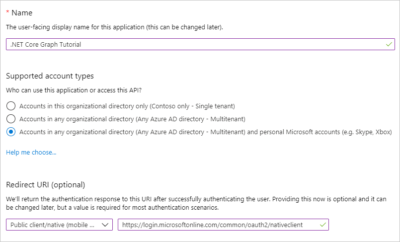

<!-- markdownlint-disable MD002 MD041 -->

En este ejercicio, creará una nueva aplicación de Azure AD con el centro de administración de Azure Active Directory.In this exercise you will create a new Azure AD application using the Azure Active Directory admin center.

1. Abra un explorador y vaya al [centro de administración de Azure Active Directory](https://aad.portal.azure.com) e inicie sesión con una **cuenta personal** (también conocida como: cuenta Microsoft) o una **cuenta profesional o educativa**.Open a browser and navigate to the [Azure Active Directory admin center](https://aad.portal.azure.com) and login using a **personal account** (aka: Microsoft Account) or **Work or School Account**.

1. Seleccione **Azure Active Directory** en el panel de navegación de la izquierda y, después, seleccione **registros de aplicaciones** en **administrar**.Select **Azure Active Directory** in the left-hand navigation, then select **App registrations** under **Manage**.

    

1. Seleccione **Nuevo registro**.Select **New registration**. En la página **Registrar una aplicación**, establezca los valores siguientes.On the **Register an application** page, set the values as follows.

    - Establezca **Nombre** como `.NET Core Graph Tutorial`.Set **Name** to `.NET Core Graph Tutorial`.
    - Establezca los **tipos de cuenta admitidos** **en las cuentas de cualquier directorio de la organización**.Set **Supported account types** to **Accounts in any organizational directory**.
    - Deje **URI de redireccionamiento** vacía.Leave **Redirect URI** empty.

    

1. Seleccione **registrar**.Select **Register**. En la página **tutorial de .net Core Graph** , copie el valor del **identificador de la aplicación (cliente)** y guárdelo, lo necesitará en el paso siguiente.On the **.NET Core Graph Tutorial** page, copy the value of the **Application (client) ID** and save it, you will need it in the next step.

    

1. Seleccione el vínculo **Agregar un URI de redireccionamiento** .Select the **Add a Redirect URI** link. En la página **URI de redireccionamiento** , busque la sección **URI de redireccionamiento sugeridos para clientes públicos (móvil, escritorio)** .On the **Redirect URIs** page, locate the **Suggested Redirect URIs for public clients (mobile, desktop)** section. Seleccione el `https://login.microsoftonline.com/common/oauth2/nativeclient` URI.Select the `https://login.microsoftonline.com/common/oauth2/nativeclient` URI.

    

1. Busque la sección **tipo de cliente predeterminado** y cambie la opción **tratar aplicación como un cliente público** cambie a **sí**y, a continuación, elija **Guardar**.Locate the **Default client type** section and change the **Treat application as a public client** toggle to **Yes**, then choose **Save**.

    
